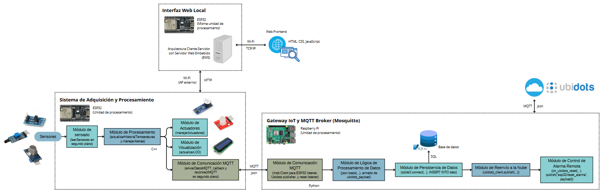
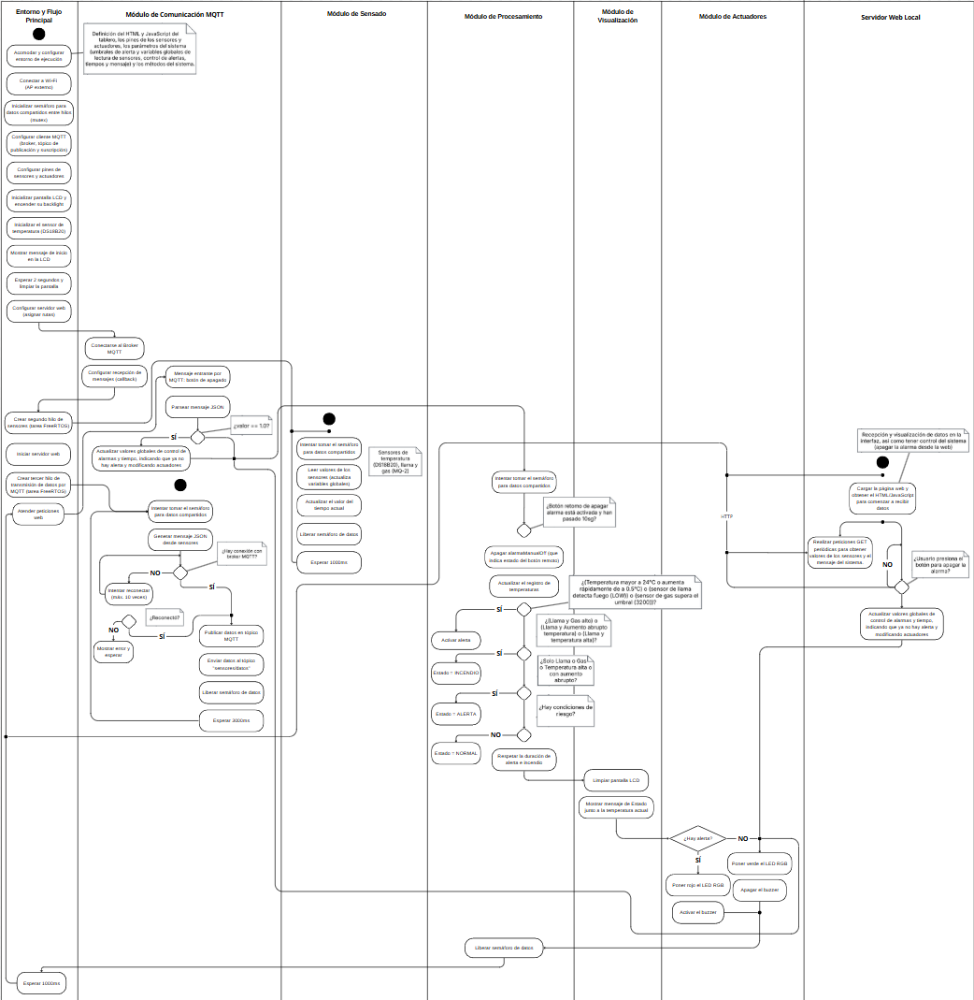
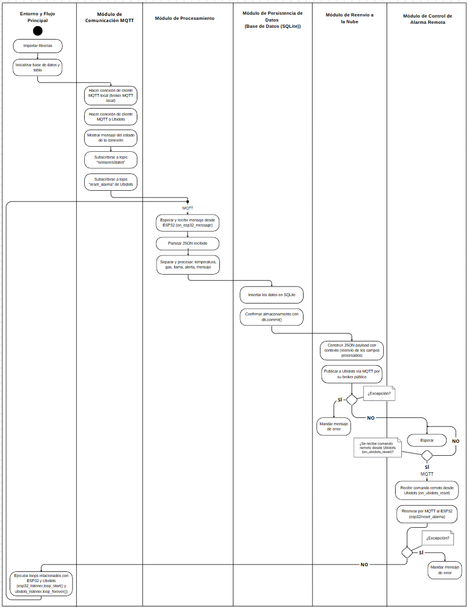
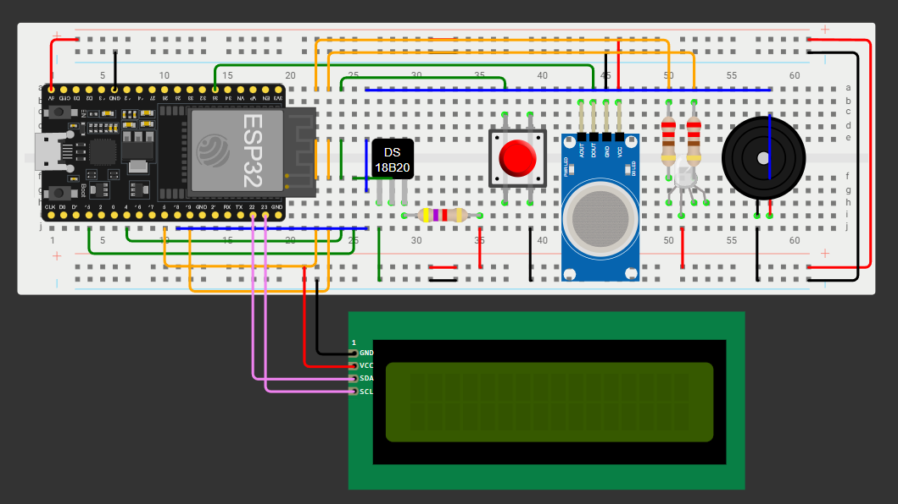

# Sistema IoT para Detección de Incendios en los Cerros Orientales de Bogotá - Challenge 3

## Información del Proyecto
- **Universidad:** Universidad de La Sabana  
- **Facultad:** Facultad de Ingeniería  
- **Materia:** Internet de las Cosas  
- **Profesor:** Juan Manuel Aranda López King  

## Integrantes del Proyecto
| Nombre | Correo Electrónico |
|--------|-------------------|
| Valentina Alejandra López Romero | valentinalopro@unisabana.edu.co |
| Ana Lucía Quintero Vargas | anaquiva@unisabana.edu.co |
| Mariana Valle Moreno | marianavamo@unisabana.edu.co |

## Estructura de la Documentación
- [1. Introducción](#1-introducción)
- [2. Motivación y Justificación](#2-motivación-y-justificación)
- [3. Solución Propuesta](#3-solución-propuesta)
- [4. Configuración Experimental, Resultados y Análisis](#4-configuración-experimental-resultados-y-análisis)
- [5. Autoevaluación del Protocolo de Pruebas](#5-autoevaluación-del-protocolo-de-pruebas)
- [6. Conclusiones, Retos y Mejoras Futuras](#6-conclusiones-retos-y-mejoras-futuras)
- [7. Referencias](#7-referencias)
- [8. Anexos](#8-anexos)

---

## 1. Introducción
<p align="justify">
Los cerros orientales de Bogotá son fundamentales para la regulación climática y la conservación de la biodiversidad. Su presencia como barrera y protector natural constituye un regulador del clima, del cual depende en buena medida la disponibilidad de agua para la capital y municipios aledaños [1]. Además, son esenciales en la producción de oxígeno en una sabana donde la pérdida de vegetación es creciente, lo que los hace aún más vulnerables a incendios forestales agravados por sequías prolongadas, altas temperaturas y la acumulación de material seco, junto con actividades humanas como fogatas, quemas agrícolas y expansión urbana descontrolada [2].
</p>

<p align="justify">
Ante este panorama, es fundamental implementar sistemas inteligentes de monitoreo ambiental que permitan la detección temprana de incendios y habiliten una respuesta efectiva por parte de las autoridades. Este proyecto propone el desarrollo de un sistema IoT que integra sensores físicos con una arquitectura de comunicación basada en MQTT, diseñada para recolectar, analizar y transmitir en tiempo real datos sobre temperatura, presencia de gas y detección de llama en los cerros orientales de Bogotá.
</p>

<p align="justify">
La información capturada se visualiza localmente a través de un servidor web embebido en el ESP32 y, simultáneamente, se envía a una Raspberry Pi que actúa como IoT Gateway. Allí, los datos se almacenan en una base de datos SQLite y se reenvían a la plataforma IoT Ubidots. Esta plataforma permite la consulta remota desde cualquier navegador web, la recepción de alertas y la ejecución de acciones como el apagado de alarmas físicas mediante un botón interactivo. De esta forma, se garantiza un monitoreo constante, una trazabilidad confiable de los datos recolectados y una capacidad de respuesta rápida y descentralizada ante posibles emergencias ambientales; de esta manera, contribuyendo para optimizar los tiempos de respuesta, reducir el impacto ambiental de los incendios y fortalecer las estrategias de prevención.
</p>

---

## 2. Motivación y Justificación
<p align="justify">
Actualmente, la detección de incendios en los cerros orientales de Bogotá depende principalmente de vigilancia manual o reportes ciudadanos, lo que retrasa la respuesta de las autoridades y agrava los daños ecológicos, sociales y económicos. Ante este contexto, surge la necesidad de implementar soluciones tecnológicas que permitan un monitoreo constante, preciso y en tiempo real, capaces de generar alertas automáticas y accesibles desde cualquier punto del país.
</p>

<p align="justify">
Este proyecto propone una solución basada en Internet de las Cosas (IoT) que integra un sensor de temperatura (DS18B20), un sensor de llama y un sensor de gas (MQ-2), conectados a un ESP32 que recolecta los datos y activa alarmas visuales y sonoras, incluyendo un zumbador activo, un LED RGB y un módulo LCD I2C, para generar notificaciones en tiempo real en caso de riesgo. La información capturada se transmite mediante el protocolo de comunicación MQTT a una Raspberry Pi, que actúa como IoT Gateway, donde se almacenan los datos en una base de datos SQLite y se reenvían a la plataforma IoT Ubidots. Desde allí, las autoridades pueden visualizar remotamente los datos desde cualquier navegador web o dispositivo móvil, además, de recibir y desactivar las alertas fisicas automatizadas.
</p>

<p align="justify">
Gracias a su arquitectura modular, al uso de comunicación inalámbrica y a su capacidad de respuesta automática, esta solución mejora significativamente los tiempos de reacción ante emergencias, facilita el seguimiento preciso de las condiciones ambientales y contribuye al fortalecimiento de estrategias prevención y mitigación de incendios forestales en zonas vulnerables y de difícil acceso.
</p>

---

## 3. Solución Propuesta

### Restricciones de Diseño Identificadas

<p align="justify"> 
Al desarrollar el sistema IoT para detectar incendios en los cerros orientales de Bogotá, se identificaron varias restricciones que afectan su diseño, implementación y comunicación de datos:
</p> 

#### 1. Técnicas
- Se usa un **ESP32**, el cual tiene un límite en la memoria RAM y el procesamiento, lo que puede afectar la ejecución simultánea del servidor web local, la recolección de datos de sensores, la transmisión de datos mediante MQTT hacia el broker en la Raspberry Pi.
- Los sensores de **temperatura, gas (MQ-2) y llama** requieren una calibración precisa para minimizar falsas alarmas, además de que tienen determinados tiempos de respuesta que pueden influir en la detección temprana de incendios.
- Dependencia de una conexión estable de WiFi para enviar y visualizar los datos en la interfaz web local, mantener la conexión activa con el broker MQTT y permitir la actualización de estados en tiempo real hacia Ubidots.
- Para la gestión de múltiples tareas, se implementó un enfoque optimizado que permite la adquisición de datos sin afectar la estabilidad del sistema y la transmisión de datos por MQTT.
- El sistema debe gestionar reconexiones automáticas al broker MQTT para garantizar continuidad en la transmisión de datos ante caídas de red.
- La Raspberry Pi debe estar configurada de forma robusta para funcionar como un broker MQTT estable, lo que incluye la gestión de múltiples conexiones simultáneas si se escala el sistema.
- Dependencia de servicios en la nube (Ubidots), lo que introduce una nueva capa de posibles fallas externas (caídas del servicio, latencia en internet).

#### 2. Económicas
- Se sigue buscando minimizar costos, utilizando hardware como el ESP32, sensores económicos pero siendo lo suficientemente confiables y precisos para realizar apropiadamente las mediciones; y una Raspberry Pi como broker local en lugar de servicios en la nube de pago (por ejemplo, brokers MQTT comerciales).
- Utilización del Free Trial de Ubidots para el monitoreo en la nube.
- uso de tecnologías inalámbricas evita la necesidad de instalaciones físicas costosas (cableados extensivos, redes cableadas).
  
#### 3. Regulatorias
- Se debe cumplir con normativas ambientales y estándares de seguridad eléctrica para su instalación de equipos electrónicos en zonas protegidas y transmisión de datos desde dispositivos de monitoreo ambiental.
- Cualquier intervención en los cerros debe ajustarse a regulaciones locales.
- Debe revisarse el cumplimiento de normas sobre protección de datos y transmisión segura con plataformas externas (Ubidots).

#### 4. Espaciales
- El sistema debe ser compacto y resistente a condiciones climáticas adversas (lluvia, humedad y polvo).
- Los sensores deben estar ubicados estratégicamente para detectar cambios de temperatura y gases sin interferencias, maximizando su efectividad sin afectar el ecosistema.
- Para el montaje del sistema, la integración de la pantalla LCD, los LEDs y los sensores debe ser compacta y accesible.

#### 5. Escalabilidad
- Aunque es un prototipo, debe permitir mejoras o expansión en el futuro como agregar más nodos ESP32 reportando al mismo broker Raspberry Pi y hacer que Ubidots permite visualizar múltiples dispositivos o variables en un mismo tablero de control. 
- Si se desean conectar múltiples dispositivos a un mismo servidor, se debe optimizar la comunicación para no saturar la red.
- Si se requiere monitoreo en varias áreas, se debe considerar el crecimiento del número de conexiones simultáneas al broker local y el impacto en el desempeño de la red WiFi.

#### 6. Temporales
- El sistema debe operar en **tiempo real** para detectar incendios lo más rápido posible, donde se establece un intervalo adecuado entre lecturas en los sensores para evitar saturación del sistema sin comprometer la detección temprana (3 segundos), en este caso para la publicación de datos MQTT y que el servidor local y la nube muestren las actualizaciones casi inmediatamente después de cada lectura.
- El sistema ahora requiere mecanismos de reconexión automática para el broker MQTT y para el WiFi, minimizando la necesidad de intervención manual constante.
  
### Arquitectura Propuesta

<p align="justify"> 
A continuación, se presenta un Diagrama de Bloques que ilustra los elementos de hardware y software que conforman la solución IoT desarrollada.
</p> 


*Figura 1: Arquitectura IoT propuesta de la solución.*

<p align="justify"> 
El sistema está basado en un ESP32, que actúa como la unidad de procesamiento principal y se encarga de la adquisición y preprocesamiento de datos provenientes de los sensores de temperatura (DS18B20), gas (MQ-2) y llama. El módulo de sensado opera de forma continua en segundo plano, y la información recopilada es analizada localmente para actualizar el historial de temperaturas, detectar condiciones de riesgo y gestionar alertas en tiempo real. En caso de que se determine una situación de peligro, el módulo de actuadores entra en acción, activando un LED RGB y un buzzer para alertar sobre el estado del ambiente. Asimismo, el módulo de visualización local actualiza la pantalla LCD I2C, donde se muestra en tiempo real la temperatura y el estado general del entorno. </p>

<p align="justify">
De igual forma, con respecto a la visualización local, el ESP32 implementa un servidor web embebido (EWS), permitiendo a los usuarios monitorear el sistema en tiempo real a través de una interfaz web accesible desde cualquier dispositivo conectado a la misma red WiFi, la cual puede establecerse utilizando un punto de acceso externo (AP o router). La comunicación entre el ESP32 y los navegadores web se realiza mediante el protocolo TCP/IP. </p>

<p align="justify"> En cuanto a la comunicación externa, el ESP32 utiliza el protocolo MQTT para enviar periódicamente los datos adquiridos a una Raspberry Pi configurada como Gateway IoT. Esta Raspberry Pi alberga un broker Mosquitto y una base de datos SQLite que permite el almacenamiento local de la información, proporcionando una capa adicional de persistencia y respaldo de datos. </p>

<p align="justify"> Adicionalmente, la Raspberry Pi se encarga de reenviar los datos relevantes a la plataforma en la nube Ubidots, también utilizando el protocolo MQTT. Desde Ubidots, se habilita la supervisión remota del sistema y el control de alarmas, permitiendo el envío de comandos de respuesta hacia el ESP32 en situaciones de emergencia o condiciones anómalas. </p>

<p align="justify">
Cabe resaltar que toda la lógica de adquisición, procesamiento, comunicación y control ha sido desarrollada en C++ para el ESP32 y Python para la Raspberry Pi, garantizando una operación eficiente, autónoma y resiliente del sistema IoT propuesto. Esta integración de hardware y software permite monitorear el entorno de forma local y remota, maximizando la confiabilidad y accesibilidad de la solución. </p>


### Desarrollo Teórico Modular: Criterios de Diseño Establecidos
Para que el sistema sea eficiente y funcional, se definieron los siguientes criterios de diseño:

#### 1. Fiabilidad y Precisión
- Se seleccionaron sensores adecuados para la detección confiable sobre temperatura, gases y llamas.
- Se implementaron límites y filtros dentro del código para reducir errores y evitar falsas alarmas.
- Se optimizó la adquisición de datos mediante procesamiento concurrente, asegurando mediciones en tiempo real.

#### 2. Autonomía y Eficiencia
- El sistema es **autosuficiente**, operando sin necesidad de conexión a redes externas para su funcionamiento básico local.
- Su diseño es resistente a la intemperie, minimizando la necesidad de mantenimiento.
- Se implementaron mecanismos de gestión de tareas para evitar interrupciones en la adquisición de datos y la respuesta del sistema.
  - Se implementó **FreeRTOS**, lo que permitió la creación de un segundo y tercer hilo, mejorando la gestión del tiempo de ejecución de las tareas.
- **Concurrencia en FreeRTOS:** La concurrencia permite que varias tareas se ejecuten de manera que parecen realizarse simultáneamente.
  - Con **FreeRTOS**, se logró una gestión real de tareas en paralelo mediante múltiples hilos de ejecución.

#### 3. Interfaz de Usuario Intuitiva
- Se usa una **pantalla LCD** para mostrar datos en tiempo real localmente.
- Se integró un servidor web embebido (EWS) con HTML y JavaScript para la visualización remota a nivel de red local.
- Se incorporaron gráficos dinámicos con historial de mediciones recientes en la interfaz web.
- Se implementaron **alarmas visuales (LED RGB) y sonoras (zumbador)** para notificaciones inmediatas sobre condiciones de riesgo.
- Adicionalmente, se habilitó la monitorización remota a través de la nube utilizando la plataforma Ubidots, proporcionando acceso a la información desde cualquier lugar con conexión a Internet.

#### 4. Escalabilidad y Modularidad
- El sistema fue diseñado de forma **modular**, permitiendo agregar nuevos sensores o funciones en el futuro de manera sencilla.
- Se implementó el protocolo **MQTT** como capa de comunicación entre el dispositivo ESP32 y un Gateway IoT (Raspberry Pi).
- La Raspberry Pi no solo recibe y almacena datos localmente utilizando SQLite, sino que también actúa como puente para transmitir los datos a la nube (Ubidots) mediante MQTT.

#### 5. Persistencia de Datos y Resiliencia
- Se implementó un esquema de persistencia local mediante una base de datos SQLite en la Raspberry Pi, garantizando que los datos históricos estén disponibles incluso en caso de pérdida temporal de conexión a Internet.
- La duplicidad de almacenamiento (local en la Raspberry Pi y en la nube con Ubidots) asegura la disponibilidad continua de la información crítica.


### Diagramas UML
<p align="justify"> 
Las siguientes figuras ilustran los Diagramas de Actividad UML de la solución propuesta, donde se representan los flujos de ejecución del sistema de monitoreo y alerta. Para una mejor visualización, se proporciona un enlace adicional:
</p>


*Figura 2: Diagrama UML de actividades de la solución propuesta - ESP32.*


*Figura 3: Diagrama UML de actividades de la solución propuesta - Raspberry Pi.*

- ***Link para mejor visualización de los diagramas:*** [https://www.canva.com/design/DAGltZirFnE/EE1g_EzG_OeKU2u2RzFSxw/view?utm_content=DAGltZirFnE&utm_campaign=designshare&utm_medium=link2&utm_source=uniquelinks&utlId=h096d0f7c1d](https://www.canva.com/design/DAGltZirFnE/EE1g_EzG_OeKU2u2RzFSxw/view?utm_content=DAGltZirFnE&utm_campaign=designshare&utm_medium=link2&utm_source=uniquelinks&utlId=h096d0f7c1d)

<p align="justify"> 
Los diagramas representan el flujo de ejecución de los dos componentes principales del sistema: el ESP32, encargado de la sensorización y del procesamiento, y la Raspberry Pi, responsable del almacenamiento y envío de información hacia la nube. </p>

#### Flujo de Actividades en el ESP32

<p align="justify"> 
El ESP32 tiene la responsabilidad de capturar y procesar inicialmente los datos del entorno, así como de activar mecanismos de alerta en caso de detectar condiciones anómalas. Su flujo de ejecución se organiza en los siguientes módulos principales: </p>

- **Entorno y flujo principal:** Configura los pines de entrada y salida, inicializa la pantalla LCD, los sensores (temperatura, gas y llama) y las variables globales de estado. También se inicia un servidor web local para permitir la interacción desde un navegador web.
- **Módulo de comunicación MQTT:** De forma general y en un segundo hilo, establece la conexión con el broker MQTT para publicar los datos de los sensores y recibir posibles comandos desde la nube.
- **Módulo de sensado:** En un tercer hilo, realiza lecturas periódicas de los sensores (DS18B20, MQ-2, sensor de llama), obteniendo mediciones en tiempo real del entorno físico.
- **Módulo de procesamiento:** Analiza los datos capturados utilizando reglas basadas en umbrales predefinidos, determinando si las condiciones son seguras o de alerta. Además, se registran los valores de temperatura y se encarga de respetar la duración establecida para las alertas.
- **Módulo de actuadores:** Si se detecta una alerta específica o de incendio, se activa la alarma poniendo el LED RGB en color rojo (indicando nivel de riesgo) y activando el buzzer para generar una advertencia sonora. En caso contrario, se desactiva este último y el LED toma un color verde.
- **Módulo de visualización:** Actualiza los datos en la pantalla LCD y en el cliente web local. Permite al usuario visualizar las condiciones en tiempo real y gestionar la desactivación de la alarma si es necesario. Lo anterior se logra a partir de la recepción de solicitudes HTTP GET desde el navegador para actualizar datos y gestionar la alarma.

<p align="justify"> 
Finalmente, Este ciclo de captura, procesamiento y comunicación se repite aproximadamente cada 1000 ms, asegurando un monitoreo constante y en tiempo real. </p>

#### Flujo de Actividades en la Raspberry Pi

<p align="justify"> La Raspberry Pi cumple la función de centro de comunicación externa, recopilando los datos provenientes del ESP32, almacenándolos localmente en una base de datos y retransmitiéndolos hacia la nube. El flujo de ejecución está compuesto por los siguientes módulos: </p>

- **Entorno y flujo principal:** Inicializa la configuración de red, establece la conexión con el broker MQTT y crea o abre la base de datos local (SQLite) para el almacenamiento de registros históricos.
- **Módulo de comunicación MQTT:** Se suscribe a los tópicos relevantes para recibir los datos enviados por el ESP32, y puede publicar comandos de control (por ejemplo, para apagar alarmas).
- **Módulo de procesamiento:** Parsea la información recibida en json desde el tópico MQTT para poder separar y acceder a sus valores de temoeratura, gas, llama, alerta y mensaje.
- **Módulo de persistencia de datos:** Guarda los datos de sensores junto con marcas de tiempo en la base de datos local, garantizando un respaldo histórico de la información recibida.
- **Módulo de reenvío a la nube:** Transfiere los datos procesados a plataformas de monitoreo remoto como Ubidots, asegurando que los usuarios puedan visualizar información en tiempo real desde cualquier ubicación.
- **Módulo de control de alarma remota:** Permite enviar comandos desde la nube para desactivar la alarma física conectada al ESP32, cerrando así el ciclo de control remoto del sistema.

<p align="justify"> La colaboración entre el ESP32 y la Raspberry Pi permite una solución de monitoreo robusta, que no solo detecta eventos de riesgo en tiempo real, sino que también ofrece almacenamiento de datos, visualización remota y control de alarmas a través de la nube. </p>


### Esquemático de Hardware
En seguida, se muestra el diagrama que representa el Esquemático de Hardware de la solución planteada.


*Figura 4: Esquemático de hardware de la solución propuesta.*

<p align="justify"> 
Para la simulación en Wokwi con el ESP32, se utilizó un sensor de temperatura real. Sin embargo, debido a la falta de disponibilidad de sensores de gas y llama en la plataforma, se optó por simular su comportamiento utilizando un potenciómetro y un botón, respectivamente.
</p>

- **Simulación del sensor de gas:** Se empleó un potenciómetro conectado a un pin analógico, permitiendo ajustar manualmente el valor que representaba la concentración de gas. Aunque Wokwi dispone de un sensor de gas que mide en ppm, se decidió utilizar el potenciómetro para mantener la coherencia con la lógica del código, que no trabaja con unidades específicas de concentración, sino con un umbral predefinido para activar la alerta.

- **Simulación del sensor de llama:** Se utilizó un botón como entrada digital para indicar la presencia de fuego. Al presionar el botón, se generaba una señal de activación similar a la que enviaría un sensor de llama real.

<p align="justify"> 
Además de estos elementos, el sistema cuenta con un buzzer, que se activa en caso de detectar una condición de alarma, y un LED RGB, que cambia de color en función del estado del sistema (verde y rojo). Para su correcta conexión, se utilizaron resistencias de 4.7 kΩ y 220 Ω, asegurando la adecuada polarización y protección de los componentes.
</p>
<p align="justify"> 
El código fue diseñado para gestionar tanto el sensor de temperatura como los componentes simulados, activando las alertas correspondientes según las lecturas obtenidas. Posteriormente, al trasladar el proyecto a la implementación física, se conectaron los sensores reales de temperatura, gas y llama, utilizando los mismos pines definidos en la simulación. Gracias a esta correspondencia, los ajustes en el código fueron mínimos, asegurando un comportamiento consistente entre la simulación y la implementación real. Por tanto, se puede decir que este proceso confirmó que el diseño inicial en la simulación era válido y funcional para su ejecución en hardware físico, validando la viabilidad del sistema antes de su construcción.
</p>

#### **Nota sobre la Raspberry Pi:**
<p align="justify"> En cuanto a la Raspberry Pi utilizada en la solución, no fue necesario realizar un esquemático de hardware detallado, ya que este dispositivo únicamente se conecta a la fuente de alimentación y a una tarjeta microSD. No se utilizaron conexiones directas a sensores o actuadores mediante pines GPIO en esta etapa del proyecto, enfocándose su función en el procesamiento y comunicación de datos. </p>


### Estándares de Ingeniería Aplicados
<p align="justify"> 
Para garantizar que el sistema desarrollado sea seguro, eficiente y cumpla con principios de calidad, se han aplicado diversos estándares de ingeniería en diferentes áreas del proyecto:
</p>

#### 1. Sensores y Electrónica
- **IEEE 1451:** Se siguieron principios de interoperabilidad para la integración de sensores en el sistema IoT, asegurando compatibilidad y escalabilidad.
- **ISO 9001:** Se aplicaron criterios de calidad en la selección de componentes electrónicos, garantizando confiabilidad y precisión en las mediciones.

#### 2. Programación y Software
- **Arduino Coding Standards:** Se adoptaron buenas prácticas en la escritura del código para mejorar la legibilidad, mantenibilidad y eficiencia del software en el ESP32.
- **Optimización de adquisición de datos:** Se diseñó un mecanismo para gestionar la lectura de sensores sin interrumpir otras funciones críticas del sistema, alineado con buenas prácticas en programación de sistemas embebidos.
- **Manejo de tareas concurrentes:**
  - **FreeRTOS:** Se optó por este enfoque, permitiendo la creación de un segundo y tercer hilo de ejecución real, mejorando la capacidad de respuesta del sistema y optimizando el uso del procesador. Se gestionaron prioridades y tiempos de ejecución siguiendo los principios de sistemas en tiempo real.
- **Gestión de bases de datos locales:**
  - **SQLite (ISO/IEC 9075 - SQL estándar):** Se implementó una base de datos ligera en la Raspberry Pi para almacenar los datos de los sensores de forma local, garantizando integridad y disponibilidad de la información aún en escenarios de pérdida de conectividad con la nube.
- **Comunicación Machine-to-Machine (M2M):**
  - **MQTT (OASIS Standard):** Se utilizó el protocolo MQTT para la transmisión eficiente de datos entre el ESP32, la Raspberry Pi y la plataforma Ubidots, siguiendo los estándares para sistemas de comunicación ligeros en IoT.

#### 3. Sistemas de Computación y Comunicación
- **IEEE 802.11:** Se utilizó la norma IEEE 802.11 para la conexión WiFi de la Raspberry Pi, asegurando la comunicación inalámbrica eficiente y segura dentro del sistema IoT.
- **ISO/IEC 27001:** Aunque no se implementó un sistema de gestión de seguridad de la información completo, se adoptaron principios básicos de seguridad para proteger la comunicación entre dispositivos y la nube (ej. configuración segura de credenciales, uso de HTTPS para Ubidots).

#### 4. Modelado y Documentación
- **UML (ISO/IEC 19501)**: Se utilizaron diagramas UML para representar la estructura del software y el flujo de datos dentro del sistema, facilitando la documentación y análisis del proyecto.

---


## 4. Configuración Experimental, Resultados y Análisis

### Configuración Experimental

El sistema experimental fue diseñado para monitorear condiciones ambientales críticas (temperatura, gas y llama) en un área de riesgo de incendio, utilizando una arquitectura IoT. La configuración involucró los siguientes componentes y etapas:

- **Nodo de sensado (ESP32)**: El modulo ESP32 fue configurado para leer datos de sensores de temperatura, gas y llama. Estos sensores fueron calibrados para detectar cambios rápidos en las condiciones ambientales, específicamente la temperatura y la presencia de gases inflamables o humo. El ESP32 fue programado para realizar lecturas periódicas de estos sensores y transmitir los datos mediante MQTT. Adicionalmente, el ESP32 alojó un servidor web embebido (EWS), diseñado con HTML, CSS y JavaScript, que permitió el monitoreo local de los valores de los sensores desde dispositivos conectados a la misma red Wi-Fi.

- **Gateway (Raspberry Pi)**: La Raspberry Pi actuó como el intermediario entre el nodo de sensado y la nube, utilizando el protocolo MQTT para recibir los datos desde el ESP32 y procesarlos. Se configuró Mosquitto en la Raspberry Pi, permitiendo que actuara como broker MQTT local, gestionando la comunicación entre el nodo de sensado y el gateway de manera independiente de servicios externos. La Raspberry Pi se configuró con un cliente MQTT que se suscribe al tópico de datos del ESP32, lo almacena en una base de datos SQLite local para persistencia temporal, y luego retransmite estos datos a la plataforma Ubidots a través de una conexión HTTP segura.

- **Plataforma de visualización (Ubidots)**: Ubidots fue elegido como la plataforma en la nube para visualizar los datos en tiempo real. Los datos procesados por la Raspberry Pi fueron enviados, donde se organizaron en un dashboard que permitía visualizar las condiciones ambientales (temperatura, gas y llama) de manera remota, a través de gráficos y alertas.

**Proceso de conexión de los componentes:**

1. El ESP32 mide las variables ambientales y publican los resultados en el broker MQTT (Mosquitto) alojado en la Raspberry Pi.
2. La Raspberry Pi, configurada con un cliente MQTT, se suscribe al tópico específico del ESP32.
3. Los datos recibidos se almacenan localmente en SQLite para análisis posteriores y se envían a Ubidots mediante MQTT.
4. Ubidots visualiza los datos en tiempo real mediante gráficos dinámicos, con actualizaciones cada 2-3 segundos.
5. Paralelamente, los datos pueden ser consultados localmente a través del servidor web embebido (EWS) del ESP32, proporcionando una capa de monitoreo independiente del acceso a internet.

**Ajustes técnicos importantes**:
- Se realizó un ajuste de los **umbral de temperatura a 27°C** en el sistema de alertas para adaptar el comportamiento del sistema a las condiciones de prueba.
- La configuración de  **MQTT** fueron ajustadas a lo largo del desarrollo para asegurar una transmisión estable de los datos, considerando tanto la operación del broker local Mosquitto como la retransmisión hacia la nube.


### Resultados

1. **Conexión Nodo-Gateway**: La comunicación entre el nodo ESP32 y la Raspberry Pi se logró exitosamente mediante el uso del protocolo MQTT. Se observaron pocos retrasos en la recepción de datos y en la retransmisión a la nube. Sin embargo, se identificaron problemas de **conexión intermitente** que fueron solucionados mediante el manejo adecuado de los **tópicos MQTT**.

2. **Conexión Gateway-Ubidots**: Tras la configuración correcta de las credenciales de API en la Raspberry Pi y la validación de las rutas de comunicación, los datos fueron transmitidos a Ubidots sin errores. El **tiempo de latencia** entre la lectura de los sensores, el procesamiento por la Raspberry Pi y la actualización del dashboard en Ubidots fue de **2-3 segundos** en promedio.

3. **Visualización de Datos**: En cuanto a la visualización en Ubidots, los datos de temperatura, gas y llama se mostraron correctamente en tiempo real en gráficos. Además, se implementaron **alertas personalizadas** en Ubidots que se activan cuando la temperatura supera los **27°C**, el gas registra un valor superior a **3200** o si se detecta presencia de llama. Adicionalmente, el servidor web embebido (EWS) alojado en el ESP32 permitió una visualización local efectiva de las mediciones, accesible a través de dispositivos conectados a la misma red Wi-Fi. Esta funcionalidad ofreció una alternativa de monitoreo en tiempo real, independiente del estado de la conexión hacia la nube.

4. **Problemas de Pruebas**: Una de las principales dificultades fue la limitación de los simuladores disponibles. Aunque se utilizó **Wokwi** para realizar la simulación del hardware y validar los esquemas de conexión, este simulador no soportaba la simulación de la parte crucial del proyecto, que era la conexión **MQTT** para la transmisión de datos entre el ESP32 y la Raspberry Pi. Debido a esta limitación, la validación del sistema se tuvo que hacer completamente en un entorno físico, lo que aumentó significativamente el tiempo de desarrollo y ajuste. Cada cambio en la configuración o en el código requería nuevas pruebas físicas de los dispositivos, lo que complicó la integración y el monitoreo en tiempo real.

### Análisis

- **Uso de MQTT**: El protocolo MQTT demostró ser adecuado para la transmisión de datos entre el ESP32 y la Raspberry Pi. La facilidad de integración con Ubidots y la capacidad de enviar pequeños paquetes de datos con alta frecuencia fueron ventajas significativas. No obstante, los problemas de **reconexión MQTT** fueron un desafío, especialmente cuando se producían caídas de la red.

- **Eficiencia en la transmisión de datos**: La configuración de la conexión MQTT fue optimizada para garantizar que los datos fueran enviados de manera confiable. Sin embargo, la **latencia** observada entre el nodo y la nube (2-3 segundos) fue aceptable en función de los requerimientos del proyecto, pero podría mejorarse con una red más robusta. Cabe resaltar que, en contraste, la actualización del estado y la desactivación de alarmas físicas a través del servidor web embebido (EWS) local del ESP32 fue prácticamente instantánea, ya que no dependía de la transmisión de datos a servidores externos.

- **Dependencia de las pruebas físicas**: La falta de simuladores como Wokwi para probar las conexiones complicó la depuración, ya que cada cambio en el código o configuración requería pruebas físicas con todos los dispositivos conectados. Esto alargó el proceso de validación y complicó la identificación temprana de problemas.  
</p>


## 5. Autoevaluación del Protocolo de Pruebas
<p align="justify"> 

### Mejoras Identificadas en el Proceso de Pruebas

1. **Automatización de pruebas**: Durante el proceso, se identificó que la automatización de pruebas podría haber reducido el tiempo de validación. Scripts de pruebas automáticas para verificar la conexión MQTT, la recepción de datos en Ubidots y las alertas podrían haber sido implementados para validar cada parte del sistema sin necesidad de intervención manual.

2. **Monitoreo y depuración de MQTT**: Utilizar herramientas como **MQTT Explorer** hubiera permitido monitorear los tópicos MQTT en tiempo real, lo que hubiera facilitado la identificación de problemas en la conexión entre el ESP32 y la Raspberry Pi.

3. **Mejora en la estructura de alertas**: Se podría mejorar el protocolo de alertas implementando más umbrales de temperatura y gas, permitiendo una mayor sensibilidad ante variaciones menores en las condiciones ambientales.

4. **Simulación de redes**: Aunque se utilizó Wokwi para validar esquemas básicos de conexión de hardware, se identificó la necesidad de contar con herramientas de simulación más completas que permitan emular también la comunicación de red (como la transmisión MQTT). La falta de este tipo de simuladores obligó a realizar pruebas físicas continuas, lo que aumentó el tiempo de desarrollo y ajuste.


### Comparación de Desempeño con Expectativas Iniciales

| Aspecto | Expectativa Inicial | Desempeño Real |
|:--------|:--------------------|:---------------|
| **Estabilidad de conexión** | Alta, con protocolo MQTT confiable | Media-alta; se presentaron desconexiones intermitentes en la red |
| **Velocidad de actualización de datos** | 1 segundo para transmisión y visualización | 1-3 segundos |
| **Facilidad de pruebas** | Uso de simuladores para simplificar el proceso | Baja; dependencia completa de pruebas físicas |
| **Visualización en nube** | Correcta, sin problemas de latencia | Correcta, con una pequeña latencia debido a la red y el tamaño de los datos |

</p>


## 6. Conclusiones, Retos y Mejoras Futuras

### Conclusiones

El sistema IoT desarrollado para la detección de incendios utilizando ESP32, Raspberry Pi, MQTT y Ubidots demostró ser **funcional y confiable** para el monitoreo de condiciones ambientales críticas. A pesar de los desafíos técnicos, el sistema cumplió con los objetivos planteados de **visualización en tiempo real** y **alertas remotas**. La integración de la plataforma Ubidots permitió una **gestión centralizada de los datos** y facilitó la toma de decisiones rápidas en situaciones críticas.


### Retos Presentados Durante el Desarrollo del Proyecto

1. **Problemas de conexión entre los dispositivos**: La conexión intermitente entre el ESP32 y la Raspberry Pi fue uno de los primeros desafíos. Este problema se debió a configuraciones iniciales incorrectas de los tópicos MQTT y los parámetros de conexión. A pesar de que se intentaron varias soluciones, la estabilidad solo se logró después de ajustar adecuadamente los parámetros de conexión y los tópicos MQTT. 

2. **Dificultades en la visualización en Ubidots**: Uno de los problemas más significativos fue la correcta visualización de los datos en la plataforma Ubidots. Inicialmente, los datos no se visualizaban correctamente debido a errores en el formato del mensaje JSON. Sin embargo, después de realizar los ajustes necesarios, los datos comenzaron a llegar de manera precisa y se reflejaron en los dashboards de Ubidots, permitiendo la visualización en tiempo real.

3. **Dificultades con el botón de apagado de alarmas**: Durante las primeras pruebas, se presentaron dificultades con el botón de apagado de alarmas físicas, que no respondía correctamente aunque el mensaje de desactivación había sido correctamente reenviado desde Ubidots. Después de parsear el mensaje JSON correctamente, se logró que el botón funcionara como se esperaba, permitiendo la desactivación de las alarmas físicas desde la plataforma.

4. **Falta de simuladores**: La imposibilidad de usar herramientas como **Wokwi** para simular la parte de MQTT complicó la depuración, ya que dependíamos completamente de las pruebas físicas para validar cada parte del sistema. Aunque Wokwi fue útil para simular el hardware y la conexión básica de los dispositivos, la falta de soporte para MQTT significó que no pudimos realizar pruebas previas a nivel de red y comunicación, lo que retrasó la detección de problemas y aumentó el tiempo de ajuste.


### Trabajo Futuro

1. **Optimización de la red**: Se deben implementar **mecanismos de reconexión automática** para garantizar una mayor estabilidad en la transmisión de datos MQTT.

2. **Escalabilidad**: Se podría considerar la integración de **más nodos sensores** para monitorear áreas más grandes, lo que requeriría una optimización del protocolo y la infraestructura de red.

3. **Desarrollo de pruebas automatizadas**: Crear un conjunto de pruebas automatizadas que valide la **conexión MQTT**, **funcionamiento de sensores** y la **integridad de los datos** antes de su envío a la nube.

4. **Redundancia en la transmisión de datos**: Se podría añadir una capa de redundancia para asegurar que los datos críticos sean enviados correctamente incluso en condiciones de red inestable.
</p>


## 7. Referencias

[1] N. Bustamante, “La importancia de proteger a los cerros orientales de Bogotá,” *El Tiempo*, 26 de febrero de 2019. [Online]. Disponible en: [https://www.eltiempo.com/vida/ciencia/la-importancia-de-proteger-a-los-cerros-orientales-de-bogota-279294](https://www.eltiempo.com/vida/ciencia/la-importancia-de-proteger-a-los-cerros-orientales-de-bogota-279294). [Accedido: 12-feb-2025].  

[2] El Espectador, “Incendio forestal en los cerros orientales de Bogotá: ¿Por qué se producen?,” *El Espectador*, 31 de enero de 2023. [Online]. Disponible en: [https://www.elespectador.com/cromos/famosos/incendio-forestal-en-los-cerros-orientales-de-bogota-por-que-se-producen/](https://www.elespectador.com/cromos/famosos/incendio-forestal-en-los-cerros-orientales-de-bogota-por-que-se-producen/). [Accedido: 12-feb-2025].  


## 8. Anexos

### 8.1 Actas de Reuniones

Las actas de las reuniones del proyecto se encuentran disponibles en la carpeta **Diagramas** del repositorio. Se pueden consultar para obtener más información sobre las discusiones, decisiones y acciones tomadas durante el desarrollo del sistema.

### 8.2 Códigos Fuente de los Dispositivos

#### ESP32:
```
#include <WiFi.h>
#include <WebServer.h>
#include <Wire.h>
#include <LiquidCrystal_I2C.h>
#include <OneWire.h>
#include <DallasTemperature.h>
#include <freertos/FreeRTOS.h>
#include <freertos/task.h>
#include <PubSubClient.h>
#include <ArduinoJson.h>

// ========================== HTML PARA EL TABLERO ==========================
const char* htmlPage = R"rawliteral(
  <!DOCTYPE html>
  <html lang="es">
  <head>
      <meta charset="UTF-8">
      <meta name="viewport" content="width=device-width, initial-scale=1.0">
      <title>Monitor de Incendios</title>
      <script src="https://cdn.jsdelivr.net/npm/chart.js@3.7.1/dist/chart.min.js"></script>
      <style>
          body {
              font-family: Arial, sans-serif;
              text-align: center;
              background-color: #f4f4f4;
              margin: 0;
              padding: 0;
          }
          .container {
              text-align: center;
              max-width: 100%;
              margin: 20px auto;
              padding: 20px;
              background: white;
              border-radius: 10px;
              box-shadow: 0 0 10px rgba(0, 0, 0, 0.1);
          }
          h1 {
              color: #333;
          }
          .status {
              font-size: 20px;
              margin: 10px 0;
          }
          .alert {
              color: red;
              font-weight: bold;
          }
          .safe {
              color: green;
          }
          .button {
              display: inline-block;
              padding: 10px 20px;
              margin-top: 20px;
              font-size: 16px;
              color: white;
              background-color: #007BFF;
              border: none;
              border-radius: 5px;
              cursor: pointer;
          }
          .button:hover {
              background-color: #0056b3;
          }
          table {
              width: 100%;
              max-width: 600px; // Ajusta según el tamaño que desees 
              margin: auto; // Centra la tabla
              border-collapse: collapse;
          } 
          th, td {
              padding: 10px;
              text-align: center;
              border-bottom: 1px solid #ddd;
          }
          thead {
              color: white;
              background-color: #007BFF;
          }
      </style>
  </head>
  <body>
  <div class="container">
      <h1>Monitor de Incendios - Cerro Oriental</h1>
      <p id="alerta" class="status safe">Cargando...</p>
      <p class="status"><strong>Temperatura:</strong> <span id="temp">--</span></p>
      <p class="status"><strong>Gas:</strong> <span id="gas">--</span></p>
      <p class="status"><strong>Llama:</strong> <span id="llama">--</span></p>
      <button class="button" onclick="resetAlarm()">Apagar Alarma</button>
  </div>
  <div class="container">
      <h2>Historial de Mediciones</h2>
      <table border="1">
          <thead>
              <tr>
                  <th>Tiempo</th>
                  <th>Temperatura (°C)</th>
                  <th>Gas</th>
                  <th>Llama</th>
              </tr>
          </thead>
          <tbody id="historial-body">
              <!-- Aquí se insertarán las filas dinámicamente -->
          </tbody>
      </table>
  </div>
  <script type="text/javascript" src="/script.js"></script>
  </body>
  </html>
  )rawliteral";

// ========================== CONFIGURACIÓN WiFi ==========================
const char* ssid = "---";   // Cambia esto por el nombre del hotspot del iPhone
const char* password = "---";  // Cambia esto por tu contraseña

WebServer server(80);

SemaphoreHandle_t dataMutex;

const char* mqtt_server = "raspberrypi.local";  // IP de Raspberry Pi
WiFiClient espClient;
PubSubClient client(espClient);

const char* mqtt_topic = "sensores/datos";

// Código JavaScript incrustado en una cadena
const char script_js[] PROGMEM = R"rawliteral(// Variable global para almacenar el historial de datos
  let historial = [];

  function fetchData() {
    fetch('/data')
        .then(response => response.json())
        .then(data => {
            // Actualizar valores en la interfaz
            document.getElementById("temp").innerText = data.temperatura + "°C";
            document.getElementById("gas").innerText = data.gas;
            document.getElementById("llama").innerText = data.llama ? "🔥 Detectada" : "✅ No detectada";

            // Usar el mensaje real del LCD en la alerta
            let alertaElem = document.getElementById("alerta");
            alertaElem.innerText = data.mensaje;

            // Cambiar estilo visual de la alerta
            if (data.alerta) {
                alertaElem.classList.add("alert");
                alertaElem.classList.remove("safe");
            } else {
                alertaElem.classList.add("safe");
                alertaElem.classList.remove("alert");
            }

            // Guardar en historial y actualizar la tabla
            agregarRegistroHistorial(data);
        })
        .catch(error => console.error("Error obteniendo datos:", error));
}

function agregarRegistroHistorial(data) {
    // Obtener la hora actual
    let hora = new Date().toLocaleTimeString();
    
    // Agregar nuevo registro al historial
    historial.push({
        tiempo: hora,
        temperatura: data.temperatura,
        gas: data.gas,
        llama: data.llama ? "🔥 Detectada" : "✅ No detectada"
    });

    // Limitar a los últimos 10 registros para que no se desborde la tabla
    if (historial.length > 10) {
        historial.shift();
    }

    // Actualizar la tabla
    actualizarTabla();
}

function actualizarTabla() {
    let tabla = document.getElementById("historial-body");
    tabla.innerHTML = ""; // Limpiar la tabla antes de actualizar

    historial.forEach(registro => {
        let fila = `<tr>
            <td>${registro.tiempo}</td>
            <td>${registro.temperatura}°C</td>
            <td>${registro.gas}</td>
            <td>${registro.llama}</td>
        </tr>`;
        tabla.innerHTML = fila + tabla.innerHTML;
    });
}

function resetAlarm() {
        console.log("Enviando solicitud para apagar la alarma...");
        fetch('/reset_alarm')
            .then(response => response.text())
            .then(() => {
                console.log("Alarma apagada correctamente");
                document.getElementById("alerta").innerText = "Estado Normal";
                document.getElementById("alerta").classList.add("safe");
                document.getElementById("alerta").classList.remove("alert");
            })
            .catch(error => {
                console.error("Error al resetear la alarma:", error);
            });
}

// Cargar datos al inicio y actualizar cada 5 segundos
window.onload = fetchData;
setInterval(fetchData, 5000);
)rawliteral";

// Manejar la petición del archivo script.js
void handleScriptJS() {
  server.send(200, "application/javascript", script_js);
}

// ========================== DEFINICIÓN DE PINES ==========================
// Pines de los sensores
#define TEMP_SENSOR_PIN 15   // Pin digital para el sensor de temperatura 
#define FLAME_SENSOR_PIN 4   // Pin digital para el sensor de llama
#define GAS_SENSOR_PIN 35    // Pin analógico para el sensor de gas MQ-2

// Pines de los actuadores
#define BUZZER_SENSOR_PIN 18 // Pin digital para el zumbador
#define LED_RED_PIN 5        // Pin digital para componente rojo del LED RGB
#define LED_GREEN_PIN 19     // Pin digital para componente verde del LED RGB

#define SDA_PIN 22           // Pin digital para el SDA de la pantalla LCD I2C
#define SCL_PIN 23           // Pin digital para el SCL de la pantalla LCD I2C

// Configuración de la pantalla LCD I2C
LiquidCrystal_I2C lcd(0x27, 16, 2);

// Configuración del sensor de temperatura
OneWire oneWire(TEMP_SENSOR_PIN);
DallasTemperature sensors(&oneWire);


// ========================== PARÁMETROS DEL SISTEMA ==========================
#define MAX_TEMPS 5  // Número de muestras de temperatura almacenadas

// Variables de almacenamiento de valores de sensores
float temperature;
int flameState;
int gasValue;
unsigned long tiempoActual;

// Umbrales de alerta
const float TEMP_LIMITE = 27;                  // Temperatura máxima permitida antes de alerta
const float TEMP_AUMENTO_RAPIDO = 0.5;           // Incremento rápido de temperatura en °C
const int GAS_LIMITE = 3200;                     // Límite de concentración de gas

const unsigned long DURACION_ALERTA = 3000;      // Duración de alerta estándar (ms)
const unsigned long DURACION_INCENDIO = 8000;    // Duración de alerta por incendio (ms)
const unsigned long INTERVALO_TIEMPO = 10000;    // Duración entre cada toma de medida para la temperatura

// Variables de almacenamiento de temperatura
float temperaturas[MAX_TEMPS] = {20.0, 20.0, 20.0, 20.0, 20.0};   // Inicializa con 20°C
int indice = 0;                     // Índice de la próxima lectura a almacenar
float temperaturaAnterior = 20.0;   // Inicializa con 20°C

// Variables de tiempo para alertas
unsigned long tiempoUltimaMedicion = 0;     // Guarda el tiempo de la última medicion de la temperatura
unsigned long tiempoAlerta = 0;             // Guarda el tiempo de inicio de la alerta
unsigned long tiempoIncendio = 0;           // Guarda el tiempo de inicio de la alerta de incendio
unsigned long tiempoAlarmaDesactivada = 0;  // Guarda el tiempo en el que se desactivó la alarma manualmente
const unsigned long tiempoEspera = 10000;   // 10 segundos de gracia para reactivar la alarma

bool alerta = false;                // Inicializa estado de alerta
bool esIncendio = false;            // Inicializa estado de alerta incendio
String mensaje = "Estado Normal";   // Inicializa mensaje de alerta del LCD con estado normal
bool alarmaManualOff = false;       // Falso por defecto, significa que no ha sido apagada manualmente

// ========================== LECTURA DE SENSORES ==========================
// Captura los valores de los sensores de temperatura, llama y gas
void leerSensores() {
  sensors.requestTemperatures();
  temperature = sensors.getTempCByIndex(0);    // Leer temperatura
  flameState = digitalRead(FLAME_SENSOR_PIN);  // Leer estado del sensor de llama (0 indica llama detectada)
  gasValue = analogRead(GAS_SENSOR_PIN);       // Leer nivel del sensor de gas
}

// ========================== MANEJO DE HISTORIAL DE TEMPERATURAS ==========================
// Actualiza los valores que hacen parte del registro de temperaturas
void actualizarHistorialTemperaturas() {
  temperaturas[indice] = temperature;
  indice = (indice + 1) % MAX_TEMPS;
}

// ========================== MANEJO DE ALERTAS ==========================
// Analiza los valores de los sensores y determina si se activa una alerta
void manejarAlertas() { 
  float incremento = temperature - temperaturaAnterior; // Comparación con la medición de hace 10 segundos

  // Si han pasado 10 segundos, actualizamos la referencia de temperatura
  if (tiempoActual - tiempoUltimaMedicion >= INTERVALO_TIEMPO) {
    temperaturaAnterior = temperature;
    tiempoUltimaMedicion = tiempoActual;
  }

  // Evaluar condiciones individuales
  bool tempAlta = (incremento >= TEMP_AUMENTO_RAPIDO || temperature >= TEMP_LIMITE);
  bool llamaDetectada = (flameState == LOW);
  bool gasDetectado = (gasValue > GAS_LIMITE);

  bool enTiempoGracia = alarmaManualOff && (tiempoActual - tiempoAlarmaDesactivada < tiempoEspera);

  // Si estamos en tiempo de gracia, forzar salir
  if (enTiempoGracia) {
    alerta = false;
    return;
  }

  // Evaluar si se debe activar la alerta
  bool nuevaAlerta = tempAlta || llamaDetectada || gasDetectado;
  bool dentroDeDuracion = (tiempoActual - tiempoAlerta < DURACION_ALERTA) ||
                          (esIncendio && tiempoActual - tiempoIncendio < DURACION_INCENDIO);

  if (nuevaAlerta || dentroDeDuracion) {
      alerta = true;
      tiempoAlerta = nuevaAlerta ? tiempoActual : tiempoAlerta;
      esIncendio = (llamaDetectada && gasDetectado) || (llamaDetectada && tempAlta);

      if (esIncendio) {
          tiempoIncendio = tiempoActual;
          mensaje = "ALERTA: INCENDIO";
      } else if (tempAlta) {
          mensaje = "ALERTA: Temp alta!";
      } else if (llamaDetectada) {
          mensaje = "ALERTA: Llama!";
      } else if (gasDetectado) {
          mensaje = "ALERTA: Gas!";
      }
  } else {
      alerta = false;
  }
}

// ========================== ACTUALIZACIÓN DEL LCD ==========================
// Muestra en la pantalla la temperatura y el estado actual del entorno
void actualizarLCD() {
  lcd.clear();
  lcd.setCursor(0, 0);
  lcd.print("Temp:");
  lcd.print(temperature);
  lcd.print("C");

  lcd.setCursor(0, 1);
  lcd.print(mensaje);
}

// ========================== CONTROL DE ACTUADORES ==========================
// Activa o desactiva el LED RGB y el buzzer según el estado del sistema
void manejarActuadores() {
  if (alerta && !alarmaManualOff) {
    digitalWrite(LED_RED_PIN, LOW);
    digitalWrite(LED_GREEN_PIN, HIGH);
    digitalWrite(BUZZER_SENSOR_PIN, LOW);
  } else {
    digitalWrite(LED_RED_PIN, HIGH);
    digitalWrite(LED_GREEN_PIN, LOW);
    digitalWrite(BUZZER_SENSOR_PIN, HIGH);
  }
}

// Función para crear el JSON con los datos de los sensores
String generarJSON() {
  String json = "{";
  json += "\"temperatura\":" + String(temperaturas[(indice - 1 + MAX_TEMPS) % MAX_TEMPS]) + ",";
  json += "\"gas\":" + String(analogRead(GAS_SENSOR_PIN)) + ",";
  json += "\"llama\":" + String(digitalRead(FLAME_SENSOR_PIN) == LOW) + ",";
  json += "\"alerta\":" + String(alerta ? "true" : "false") + ",";
  json += "\"mensaje\":\"" + mensaje + "\"";
  json += "}";

  return json;
}

// ========================== TRANSMISION DE DATOS ==========================
// Reconectar con broker MQTT
void reconnectMQTT() {
  int attempt = 0;
  while (!client.connected() && attempt < 10) {
    Serial.print("Conectando al broker MQTT...");
    if (client.connect("ESP32Client")) {
      Serial.println("MQTT conectado");
      client.subscribe("esp32/reset_alarma");
    } else {
      Serial.print("Falló la conexión, rc=");
      Serial.print(client.state());
      Serial.println(" reintentando en 5 segundos");
      delay(5000);
      attempt++;
    }
  }
  if (attempt == 10) {
    Serial.println("No se pudo conectar después de 10 intentos.");
  }
}

// Publicar los datos de los sensores usando MQTT
void enviarDatosMQTT() {
  if (!client.connected()) {
    reconnectMQTT();
  }

  String payload = generarJSON();

  if (client.publish(mqtt_topic, payload.c_str())) {
    Serial.println("Mensaje enviado por MQTT: " + payload);
  } else {
    Serial.println("Error al enviar mensaje MQTT.");
  }
}

// Escuchar el mensaje del tablero de Ubidots sobre el botón de apagado en un callback
void callback(char* topic, byte* payload, unsigned int length) {
  String message;
  for (int i = 0; i < length; i++) {
    message += (char)payload[i];
  }

  Serial.print("Mensaje recibido [");
  Serial.print(topic);
  Serial.print("]: ");
  Serial.println(message);

  // Parsear el JSON recibido
  StaticJsonDocument<200> doc;
  DeserializationError error = deserializeJson(doc, message);

  if (error) {
    Serial.print("Error al parsear JSON: ");
    Serial.println(error.c_str());
    return;
  }

  float valorBoton = doc["value"];  // Extraer el valor del botón

  Serial.print("Valor del botón recibido: ");
  Serial.println(valorBoton);

  // Responder a botón manual Ubidots
  if (valorBoton == 1.0) {
    alarmaManualOff = true;  // Indicar que se apagó manualmente
    tiempoAlarmaDesactivada = millis();  // Guardar el tiempo en que se desactivó la alarma
    alerta = false;  // Desactivar la alerta
    digitalWrite(BUZZER_SENSOR_PIN, HIGH);  // Apagar el buzzer (lógica negativa)
    digitalWrite(LED_RED_PIN, HIGH);  // Apagar LED rojo
    digitalWrite(LED_GREEN_PIN, LOW); // Encender LED verde

    Serial.println("Alarma desactivada manualmente desde Ubidots.");
  } else {
    Serial.println("Valor distinto de 1.0 recibido.");
  }
}

// ========================== LECTURA DE SENSORES EN SEGUNDO HILO ==========================
// Función de la tarea para leer los sensores periódicamente
void leerSensoresTask(void *pvParameters) {
  while (true) {
    if (xSemaphoreTake(dataMutex, portMAX_DELAY)) {
      leerSensores();
      tiempoActual = millis();
      xSemaphoreGive(dataMutex);
    }
    vTaskDelay(pdMS_TO_TICKS(1000)); // Espera 1000ms antes de la próxima lectura
  }
}


// ========================== TRANSMISIÓN DE DATOS EN TERCER HILO ==========================
// Función de la tarea para transmitir los datos en MQTT
void enviarDatosTask(void* parameter) {
  while (true) {
    if (xSemaphoreTake(dataMutex, portMAX_DELAY)) {
      enviarDatosMQTT();
      xSemaphoreGive(dataMutex);
    }
    vTaskDelay(pdMS_TO_TICKS(3000)); // Espera 3000ms antes de la próxima publicación
  }
}

// ========================== CONFIGURACIÓN INICIAL ==========================
void setup() {
  Serial.begin(115200);

  dataMutex = xSemaphoreCreateMutex(); // Crear un mutex (semaphore binario) global para proteger secciones críticas

  // Conectar a WiFi
  WiFi.begin(ssid, password);
  while (WiFi.status() != WL_CONNECTED) {
    delay(1000);
    Serial.println("Conectando a WiFi...");
  }
  Serial.println("Conectado a WiFi");
  Serial.print("IP: ");
  Serial.println(WiFi.localIP());

  // Configuración de pines
  pinMode(BUZZER_SENSOR_PIN, OUTPUT);
  pinMode(LED_RED_PIN, OUTPUT);
  pinMode(LED_GREEN_PIN, OUTPUT);
  pinMode(FLAME_SENSOR_PIN, INPUT);

  // Inicialización de I2C y sensores
  Wire.begin(SDA_PIN, SCL_PIN);
  lcd.begin(16, 2);
  lcd.setBacklight(255);
  sensors.begin();

  // Mensaje de inicio en LCD
  lcd.setCursor(0, 0);
  lcd.print("Sistema Alerta");
  lcd.setCursor(0, 1);
  lcd.print("Iniciando...");
  delay(2000);
  lcd.clear();

  // ========================== SERVIDOR WEB ==========================
  // Ver el dashboard con gráficos
  server.on("/", HTTP_GET, []() {
    server.send(200, "text/html", htmlPage);
  });

  // Servir el archivo JavaScript
  server.on("/script.js", HTTP_GET, handleScriptJS);

  // Acceder a los datos en formato JSON a través de la ruta /data
  server.on("/data", HTTP_GET, []() {
    String json = generarJSON();
    server.send(200, "application/json", json);
  });

  // Conectar al broker MQTT
  client.setServer(mqtt_server, 1883);
  client.setCallback(callback);
  reconnectMQTT();

  // Apagar la alarma desde la web
  server.on("/reset_alarm", HTTP_GET, []() {
    alarmaManualOff = true;  // Indicar que se apagó manualmente
    tiempoAlarmaDesactivada = millis();  // Guardar el tiempo en que se desactivó la alarma
    alerta = false;  // Desactivar la alerta
    digitalWrite(BUZZER_SENSOR_PIN, HIGH);  // Apagar el buzzer (lógica negativa)
    digitalWrite(LED_RED_PIN, HIGH);  // Apagar LED rojo
    digitalWrite(LED_GREEN_PIN, LOW); // Encender LED verde
    server.send(200, "text/html", "<h1>Alarma Apagada</h1><a href='/'>Volver</a>");
  });

  // ========================== CREAR SEGUNDO HILO PARA SENSORES ==========================
  xTaskCreate(
    leerSensoresTask, // Función de la tarea
    "SensorTask",     // Nombre de la tarea
    4096,             // Tamaño del stack
    NULL,             // Parámetro de entrada
    1,                // Prioridad
    NULL              // Handle de la tarea
  );

  server.begin();  // Inicia servidor 

  // ========================== CREAR TERCER HILO PARA TRANSMISIÓN ==========================
  xTaskCreate(
    enviarDatosTask,    // Función de la tarea
    "TransmisionTask",  // Nombre de la tarea
    4096,               // Tamaño del stack
    NULL,               // Parámetro de entrada
    2,                  // Prioridad
    NULL                // Handle de la tarea
  );
}

// ========================== BUCLE PRINCIPAL ==========================
// Ejecuta la lógica de monitoreo continuamente
void loop() {
  server.handleClient();
  client.loop();
  
  if (xSemaphoreTake(dataMutex, portMAX_DELAY)) {
    if (alarmaManualOff) {
      if (millis() - tiempoAlarmaDesactivada >= tiempoEspera) {
          alarmaManualOff = false;  // Permitir que la alarma se reactive después de 10 segundos
      }
    }

    actualizarHistorialTemperaturas();     // Actualizar el registro de temperaturas

    // Determinar si se debe activar una alerta
    manejarAlertas();

    // Respetar la duración de alerta e incendio
    if (!alarmaManualOff && (millis() - tiempoAlerta < DURACION_ALERTA || millis() - tiempoIncendio < DURACION_INCENDIO)) {
      alerta = true;
      if (millis() - tiempoIncendio < DURACION_INCENDIO) {
        mensaje = "ALERTA: INCENDIO";
      }
    } else {
      // Si no estamos en alerta y no hay peligro, mostrar Estado Normal
      if (!alerta && !(temperature >= TEMP_LIMITE || flameState == LOW || gasValue > GAS_LIMITE)) {
        mensaje = "Estado Normal";
      }
    }

    actualizarLCD();        // Mostrar en LCD el estado actual
    manejarActuadores();    // Controlar los actuadores (LED y buzzer)
    xSemaphoreGive(dataMutex);
  }

  delay(100);  // Esperar 100ms antes de la próxima iteración
}
```

#### Raspberry Pi:
```
import paho.mqtt.client as mqtt
import sqlite3
import json
import time

# Conexión a base de datos SQLite (se crea si no existe)
db = sqlite3.connect("sensores_db", check_same_thread=False)
cursor = db.cursor()

# Asegurarse de que la tabla exista
cursor.execute('''
CREATE TABLE IF NOT EXISTS datos (
    id INTEGER PRIMARY KEY AUTOINCREMENT,
    timestamp DATETIME DEFAULT CURRENT_TIMESTAMP,
    temperatura REAL,
    gas INTEGER,
    llama BOOLEAN,
    alerta BOOLEAN,
    mensaje TEXT
)
''')
db.commit()

# Token Ubidots
UBIDOTS_TOKEN = "---"
UBIDOTS_DEVICE = "raspberry-sensor-node"
UBIDOTS_TOPIC = f"/v1.6/devices/{UBIDOTS_DEVICE}"
UBIDOTS_RESET_TOPIC = f"/v1.6/devices/{UBIDOTS_DEVICE}/reset_alarma"

# MQTT cliente para enviar datos a Ubidots
ubidots_client = mqtt.Client()

# Agregar callback para verificar conexión
def on_connect(client, userdata, flags, rc):
    if rc == 0:
        print("✅ Conectado correctamente a Ubidots")
    else:
        print("❌ Error de conexión a Ubidots. Código:", rc)

ubidots_client.on_connect = on_connect
ubidots_client.username_pw_set(UBIDOTS_TOKEN, "")
ubidots_client.connect("industrial.api.ubidots.com", 1883)
ubidots_client.loop_start()  # ✅ Necesario para mantener conexión

# MQTT cliente para comunicarse con ESP32
local_broker_client = mqtt.Client()
local_broker_client.connect("localhost", 1883)

# CALLBACK: cuando llega un mensaje desde ESP32 (datos de sensores)
def on_esp32_message(client, userdata, message):
    try:
        payload = json.loads(message.payload.decode())
        print("[ESP32 ➜ Raspberry] Datos recibidos: ", payload)

        temperatura = payload["temperatura"]
        gas = payload["gas"]
        llama = payload["llama"]
        alerta = payload["alerta"]
        mensaje = payload["mensaje"]

        # Guardar en la base de datos local
        sql = '''INSERT INTO datos (temperatura, gas, llama, alerta, mensaje) 
                 VALUES (?, ?, ?, ?, ?)'''
        datos = (temperatura, gas, llama, alerta, mensaje)
        cursor.execute(sql, datos)
        db.commit()
        print("Guardado en DB local")

        # Reenviar a Ubidots por MQTT (solo campos válidos numéricamente)
        ubidots_payload = json.dumps({
            "temperatura": temperatura,
            "gas": gas,
            "llama": {
                "value": int(llama),
                "context": {
                    "estado": "Detectada" if llama else "No detectada"
                }
            },
            "alerta": {
                "value": int(alerta),
                "context": {
                    "estado": "ALERTA" if alerta else "Normal"
                }
            },
            "mensaje": {
                "value": int(alerta),
                "context": {
                    "descripcion": mensaje
                }
            }
        })
        ubidots_client.publish(UBIDOTS_TOPIC, ubidots_payload)
        print("[Raspberry ➜ Ubidots] Datos enviados: ", ubidots_payload)

    except Exception as e:
        print("Error al procesar datos del ESP32:", e)

# CALLBACK: cuando llega un mensaje desde Ubidots (botón de reset remoto)
def on_ubidots_reset(client, userdata, message):
    try:
        payload = message.payload.decode()
        print("[Ubidots ➜ Raspberry] Botón recibido:", payload)

        # Reenviar al ESP32
        local_broker_client.publish("esp32/reset_alarma", payload)
        print("[Raspberry ➜ ESP32] Botón reenviado:", payload)

    except Exception as e:
        print("Error al reenviar botón:", e)

# Suscriptor del broker local (recibe del ESP32)
esp32_listener = mqtt.Client()
esp32_listener.on_message = on_esp32_message
esp32_listener.connect("localhost", 1883)
esp32_listener.subscribe("sensores/datos")

# Suscriptor del broker de Ubidots (recibe botón)
ubidots_listener = mqtt.Client()
ubidots_listener.username_pw_set(UBIDOTS_TOKEN, "")
ubidots_listener.on_message = on_ubidots_reset
ubidots_listener.connect("industrial.api.ubidots.com", 1883)
ubidots_listener.subscribe(UBIDOTS_RESET_TOPIC)

# Ejecutar bucles
esp32_listener.loop_start()
ubidots_listener.loop_forever()
```
